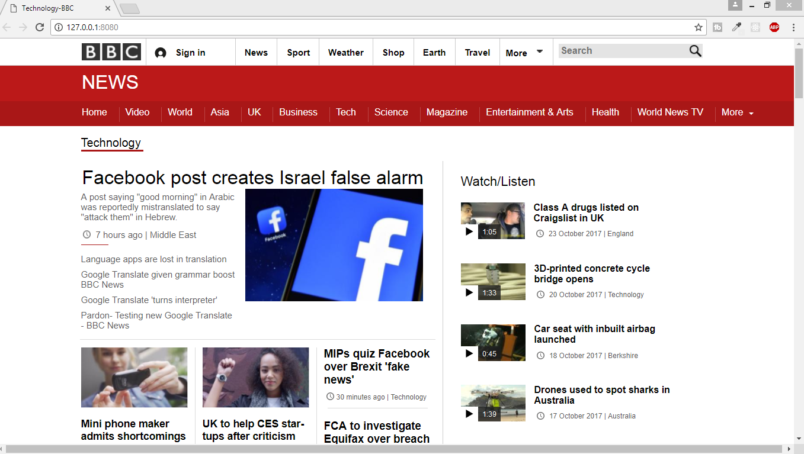

# BBC News Website - Technology Part
This project is the complete technology part of the BBC News Website. 
### See this project as a video : [YouTube](https://youtu.be/SRpgUV4lHyg)

## Built with
- HTML5
- CSS3

This project is the output of my hard working. To develop your skill, there is no way without practicing. I developed this
for practicing purpose.

## Made By
[Abdur Rahman Robin](https://github.com/robin3317)
- [Facebook](https://facebook.com/robin4java)
- [Twitter](https://twitter.com/robin4java)
- [Linkedin](https://www.linkedin.com/in/robin4java/)
